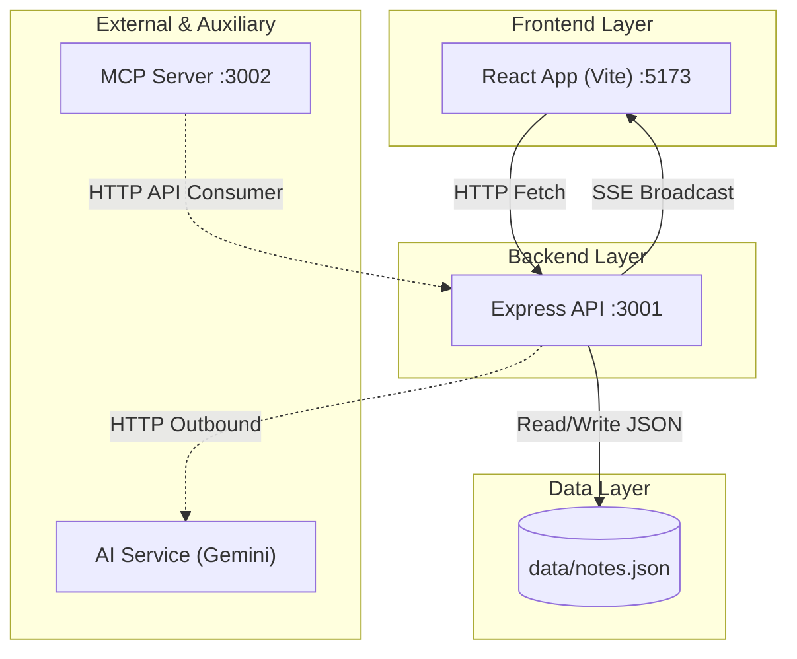

# Architecture Overview

This document serves as a critical, living document designed to equip agents with a rapid and comprehensive understanding of the codebase's architecture, enabling efficient navigation and effective contribution from day one. Update this document as the codebase evolves.

## 1. Project Structure

This section provides a high-level overview of the project's directory and file structure.

```text
[Project Root]/
├── src/
│   ├── components/       # React UI components (layout, notes, search)
│   ├── hooks/            # Custom React hooks (autosave, shortcuts)
│   ├── lib/              # Client utility functions
│   ├── server/           # Backend services and API logic
│   │   ├── ai/           # AI integration logic (Vercel AI SDK)
│   │   ├── events/       # Event listeners for side-effects
│   │   ├── api.ts        # Express API routes and setup
│   │   ├── mcp.ts        # MCP Server implementation
│   │   └── store.ts      # JSON-file note CRUD store
│   ├── shared/           # Code shared across client/server
│   │   └── schemas.ts    # Single source of truth Zod schemas
│   ├── store/            # Client-side state management (Zustand)
│   ├── types/            # UI-only TypeScript types
│   ├── App.tsx           # Root application component
│   ├── index.css         # Global CSS and Tailwind utilities
│   └── main.tsx          # React application entry point
├── data/                 # Persistent storage directory (notes.json)
├── plans/                # Project roadmap and milestone plans
├── tests/                # Testing utilities
│   └── promptfoo/        # LLM evaluation suites
├── scripts/              # Utility scripts (e.g., seed.sh)
├── postman/              # Postman API test collections
├── assetts/              # Static assets (images, icons)
├── Dockerfile.dev        # Docker configuration for development
├── docker-compose.yml    # Orchestrates app, api, and mcp services
├── Makefile              # Task runner for development commands
├── README.md             # Project overview
├── DESIGN.md             # Design system and brand guide
└── ARCHITECTURE.md       # This document
```

## 2. High-Level System Diagram

Below is the interaction flow of the system's major components.



## 3. Core Components

### 3.1. Frontend

- **Name:** Rook Notes Web Client
- **Description:** Minimalist, markdown-based note-taking user interface. Manages client-side state with optimistic updates, using incoming SSE events as an invalidation signal to trigger fresh data fetches.
- **Technologies:** React 18, Zustand (state management), TipTap (markdown editor), Tailwind CSS 4, Vite, Sonner (notifications).
- **Styling/UX:** For details on the design system, typography, and color palette, refer directly to [DESIGN.md](DESIGN.md).
- **Deployment:** Served via Vite inside the `app` Docker container.

### 3.2. Backend Services

#### 3.2.1. Express API Service

- **Name:** `api` service
- **Description:** The core backend providing REST routes, enforcing Zod validation, publishing real-time updates via Server-Sent Events (SSE), and hosting Scalar documentation. Also encapsulates the internal **AI Taxonomy Service** logic for generating tag suggestions.
- **Technologies:** Node 24, Express 5, Zod, Vercel AI SDK (Google Gemini & Anthropic integration), OpenAPI (`zod-to-openapi`), Scalar docs UI.
- **Deployment:** Runs in the `api` Docker container on port 3001.

#### 3.2.2. MCP Server

- **Name:** `mcp` service
- **Description:** A stateless Model Context Protocol server that exposes intent-based tools (`search_notes`, `create_note`, etc.) for agents like Claude Code. Acts as a consumer of the Express API.
- **Technologies:** `@modelcontextprotocol/sdk`, Streamable HTTP transport, tsx watch.
- **Deployment:** Runs in the `mcp` Docker container on port 3002.

## 4. Data Stores

### 4.1. Local JSON Store

- **Name:** `notes.json`
- **Type:** File-based JSON store
- **Purpose:** Persists all note content, metadata, and labels locally.
- **Key Schemas/Collections:** Governed by Zod schemas in `src/shared/schemas.ts` (`NoteSchema`).
- **Persistence:** Persisted using a named Docker volume `notes_data` mounted at `/app/data`.
- **Concurrency Constraint:** Relies on local filesystem interaction with a single JSON file; not designed for heavy concurrent write operations. Optimized for low-latency single-user access.

## 5. External Integrations / APIs

- **Google Gemini AI API:** Used for AI taxonomy (tag suggestions). Requires `GOOGLE_GENERATIVE_AI_API_KEY` in environment variables.
- **Claude Code / MCP Clients:** External AI tools can consume the system via the exposed `streamable-http` MCP endpoint.

## 6. Deployment & Infrastructure

- **Containerization:** Orchestrated via `docker-compose.yml` running three services (`app`, `api`, `mcp`).
- **Runtime Environment:** Node 24 (Bookworm) slim base images.
- **Volumes:** Uses named volumes for `node_modules` and application data (`notes_data`) along with source bind-mounts for real-time reload capability.
- **Task Runner:** Managed via standard `Makefile` commands (`make up`, `make down`, `make fresh`).

## 7. Security Considerations

- **Authentication:** None by design. Configured strictly as a local development playground for single-user access. Not hardened for public exposure without an outer Auth layer/proxy.
- **API Key Safety:** The `GOOGLE_GENERATIVE_AI_API_KEY` is managed locally via an `.env` file which is excluded from the repository.

## 8. Development & Testing Environment

- **Local Setup:** Spin up the entire ecosystem via `make up` or `make fresh` (which wipes, rebuilds, and seeds data).
- **Evaluation Framework:** Utilizes **Promptfoo** for LLM evals, benchmarking, and prompt iteration located in `tests/promptfoo/`.
- **Hot Reloading:** Utilizes `tsx watch` for API/MCP reloading and Vite’s HMR for frontend development.

## 9. Future Considerations / Roadmap

Based on the existing milestones located in the `/plans/` directory, current and future focus areas include:

- [x] **01-core-application:** Initial structure and basic functionality.
- [x] **02-mcp-server:** Agentic tool integration.
- [ ] **03-ai-milestones:** Staged rollout of intelligent capabilities.
    - [x] **m1-ai-suggest-tags:** 
    - [ ] **m2-ai-chat-with-vault:** 
    - [ ] **m3-ai-deduplication:** 
- [x] **04-error-handling-toast:** Refining user feedback loop for transient backend/AI errors.

## 10. Project Identification

- **Project Name:** Rook Notes
- **Description:** A fast, minimal, markdown-based note-taking playground for exploring AI-assisted development and tooling.
- **Repository Style:** Docker-first development workflow.
- **Date of Last Update:** 2026-05-10

## 11. Glossary / Acronyms

- **MCP:** Model Context Protocol
- **SSE:** Server-Sent Events
- **Zod:** TypeScript-first schema declaration and validation library
- **Vite:** Next-generation frontend tooling
- **tsx:** TypeScript Execute (used for watching/running node scripts)