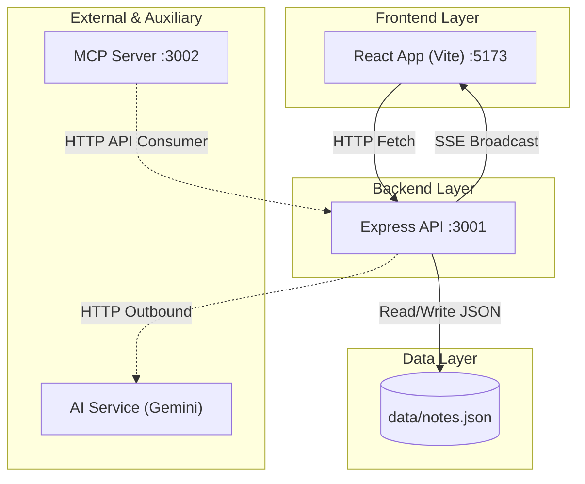

# Architecture Overview

This document serves as a critical, living document designed to equip agents with a rapid and comprehensive understanding of the codebase's architecture, enabling efficient navigation and effective contribution from day one. Update this document as the codebase evolves.

## 1. Project Structure

This section provides a high-level overview of the project's directory and file structure.

```text
[Project Root]/
├── services/
│   ├── shared/           # @rook/shared - Common Zod schemas & server configurations
│   │   ├── src/
│   │   │   └── schemas.ts# Single source of truth schemas
│   │   ├── package.json
│   │   └── tsconfig.json
│   ├── frontend/         # @rook/frontend - Vite React SPA client
│   │   ├── src/          # React components, hooks, store, and assets
│   │   ├── index.html
│   │   ├── vite.config.ts
│   │   ├── package.json
│   │   ├── service.template.yaml # Knative service template config
│   │   └── Dockerfile    # Production Frontend container (Nginx Alpine)
│   ├── api/              # @rook/api - Express API backend
│   │   ├── src/
│   │   │   ├── index.ts  # Express app and route handlers
│   │   │   ├── store.ts  # JSON-file note CRUD store
│   │   │   ├── events/   # SSE event managers and AI background trigger classifications
│   │   │   └── ai/       # AI integration logic (Vercel AI SDK)
│   │   ├── package.json
│   │   ├── tsup.config.ts# Fast tsup single-file ESM bundler config
│   │   ├── service.template.yaml # Knative service template config
│   │   └── Dockerfile    # Symmetrical, single-stage production API container
│   └── mcp/              # @rook/mcp - Model Context Protocol server
│       ├── src/
│       │   └── index.ts  # Stateless MCP server implementation
│       ├── package.json
│       ├── tsup.config.ts# Fast tsup single-file ESM bundler config
│       ├── service.template.yaml # Knative service template config
│       └── Dockerfile    # Symmetrical, single-stage production MCP container
├── data/                 # Persistent storage directory (notes.json)
├── openspec/             # OpenSpec directory for baseline specifications and changes
│   ├── changes/          # Active, proposed, and archived feature specifications
│   │   └── archive/      # Historical completed and archived specifications changes
│   └── specs/            # Main baseline system specifications
├── plans/                # Project roadmap and milestone plans
├── tests/                # Testing utilities and promptfoo configs
├── scripts/              # Utility scripts (e.g., seed.sh)
├── postman/              # Postman API test collections
├── pnpm-workspace.yaml   # Root pnpm workspaces configuration definition
├── Dockerfile.dev        # High-efficiency Docker dev container utilizing pnpm fetch
├── docker-compose.yml    # Orchestrates development services via workspace filters
└── Makefile              # Unified commands coordinator recursively running workspace filters
```

## 2. High-Level System Diagram

Below is the interaction flow of the system's major components.



## 3. Core Components

### 3.1. Frontend

- **Name:** Rook Notes Web Client
- **Description:** Minimalist, markdown-based note-taking user interface. Manages client-side state with optimistic updates, using incoming SSE events as an invalidation signal to trigger fresh data fetches.
- **Technologies:** React 18, Zustand (state management), TipTap (markdown editor), Tailwind CSS 4, Vite, Sonner (notifications).
- **Styling/UX:** For details on the design system, typography, and color palette, refer directly to [DESIGN.md](DESIGN.md).
- **Deployment:** Served via Vite inside the `app` Docker container in development; served via Nginx in `services/frontend/Dockerfile` on Google Cloud Run in production.

### 3.2. Backend Services

#### 3.2.1. Express API Service

- **Name:** `api` service
- **Description:** The core backend providing REST routes, enforcing Zod validation, publishing real-time updates via Server-Sent Events (SSE), and hosting Scalar documentation. Also encapsulates the internal **AI Taxonomy Service** logic for generating tag suggestions.
- **Technologies:** Node 24, Express 5, Zod, Vercel AI SDK (Google Gemini & Anthropic integration), OpenAPI (`zod-to-openapi`), Scalar docs UI.
- **Deployment:** Runs in the `api` Docker container on port 3001 in development; deployed as a standalone container via `services/api/Dockerfile` on Google Cloud Run in production.

#### 3.2.2. MCP Server

- **Name:** `mcp` service
- **Description:** A stateless Model Context Protocol server that exposes intent-based tools (`search_notes`, `create_note`, etc.) for agents like Claude Code. Acts as a consumer of the Express API.
- **Technologies:** `@modelcontextprotocol/sdk`, Streamable HTTP transport, tsx watch.
- **Deployment:** Runs in the `mcp` Docker container on port 3002 in development; deployed as a standalone container via `services/mcp/Dockerfile` on Google Cloud Run in production.

## 4. Data Stores

### 4.1. Local JSON Store

- **Name:** `notes.json`
- **Type:** File-based JSON store
- **Purpose:** Persists all note content, metadata, and labels locally.
- **Key Schemas/Collections:** Governed by Zod schemas in `services/shared/src/schemas.ts` (`NoteSchema`).
- **Persistence:** Persisted using a named Docker volume `notes_data` mounted at `/app/data` in development. In production on Google Cloud Run, it adopts an **Ephemeral Mode** where note data is stored locally in the container's scratch volume (defaulting to `./data`) and resets whenever the Cloud Run instance scales to zero (idle scaling).
- **Concurrency Constraint:** Relies on local filesystem interaction with a single JSON file; not designed for heavy concurrent write operations. Optimized for low-latency single-user access.

## 5. External Integrations / APIs

- **Google Gemini AI API:** Used for AI taxonomy (tag suggestions). Requires `GOOGLE_GENERATIVE_AI_API_KEY` in environment variables.
- **Claude Code / MCP Clients:** External AI tools can consume the system via the exposed `streamable-http` MCP endpoint.

## 6. Deployment & Infrastructure

- **Containerization:** Orchestrated via `docker-compose.yml` running three services (`app`, `api`, `mcp`) in development.
- **Production Containers:** Deployed as three standalone services on Google Cloud Run:
  - **Frontend client (`services/frontend/Dockerfile`)**: Pre-compiled React served via Nginx Alpine, proxying `/api` traffic downstream using dynamic environment interpolation.
  - **Express API backend (`services/api/Dockerfile`)**: Node.js container executing pre-compiled ESM vanilla JavaScript on raw node runtime engine without run-time compiler overhead.
  - **Stateless MCP server (`services/mcp/Dockerfile`)**: Node.js container executing pre-compiled ESM vanilla JavaScript on raw node runtime engine, pointing to the live API via `API_BASE_URL`.
- **Local-Packaging-Remote-Deploy Pipeline (Pure Local Container Delivery):** 
  To eliminate GitHub-triggered Cloud Build lag and repository/PR bloat from committing build artifacts (`dist/` directories) to source control:
  1. **Local Compilation & Packaging**: The source code is compiled locally inside the developer context. Symmetrical, root-relative Dockerfiles build production images on the local engine.
  2. **Direct Push**: Finished images are pushed directly to Google Artifact Registry.
  3. **Declarative Manifest Interpolation**: The parameterised `service.template.yaml` files inside each service are dynamically compiled via `make` into untracked, environment-specific `service.yaml` files (e.g., replacing region, registry, dynamic timestamps to bypass Cloud Run revision caching, and the live downstream API URL).
  4. **Instant Cloud Run Rollout**: The generated specs are applied to Cloud Run via `gcloud run services replace`, enabling rapid, terminal-driven, zero-downtime updates in seconds.
- **Runtime Environment:** Node 24 (Bookworm) slim base images.
- **Volumes:** Uses named volumes for `node_modules` and application data (`notes_data`) along with source bind-mounts for real-time reload capability in development.
- **Task Runner:** Managed via standard `Makefile` commands (`make up`, `make down`, `make fresh` for dev; `make prod-verify`, `make prod-app-verify`, and `make prod-backend-verify` for production local checks, plus `make prod-release-all` and `make prod-urls` for the remote pipeline).

## 7. Security Considerations

- **Authentication:** None by design. Configured strictly as a local development playground for single-user access. Not hardened for public exposure without an outer Auth layer/proxy.
- **API Key Safety:** The `GOOGLE_GENERATIVE_AI_API_KEY` is managed locally via an `.env` file which is excluded from the repository.

## 8. Development & Testing Environment

- **Local Setup:** Spin up the entire ecosystem via `make up` or `make fresh` (which wipes, rebuilds, and seeds data).
- **Evaluation Framework:** Utilizes **Promptfoo** for LLM evals, benchmarking, and prompt iteration located in `tests/promptfoo/`.
- **Hot Reloading:** Utilizes `tsx watch` for API/MCP reloading and Vite’s HMR for frontend development.

## 9. Project Identification

- **Project Name:** Rook Notes
- **Description:** A fast, minimal, markdown-based note-taking playground for exploring AI-assisted development and tooling.
- **Repository Style:** Docker-first development workflow.
- **Date of Last Update:** 2026-05-10

## 10. Glossary / Acronyms

- **MCP:** Model Context Protocol
- **SSE:** Server-Sent Events
- **Zod:** TypeScript-first schema declaration and validation library
- **Vite:** Next-generation frontend tooling
- **tsx:** TypeScript Execute (used for watching/running node scripts)